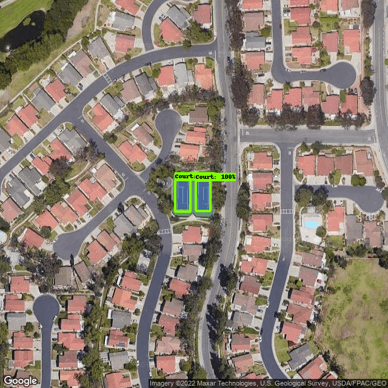
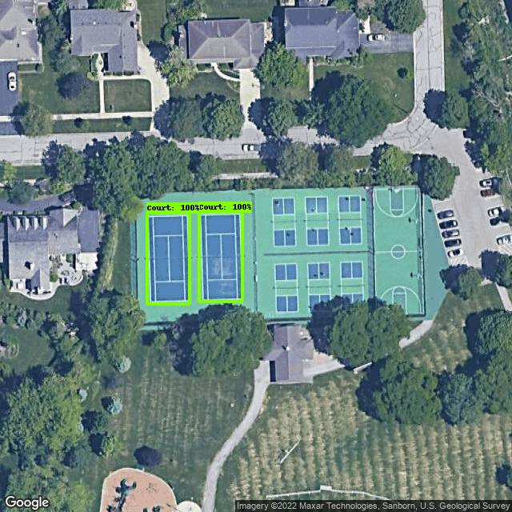

# Tennis Court Locator
## Purpose:
I started this project to help identify local tennis courts in my area. Many of the known courts are private, or require some sort of membership or pay-to-play in order to gain access to the court. Every once in a while, I'll discover a tennis court I didn't know existed and they are often open to the public. These courts don't normally come up in a search engine query. 

With this project, I will be able to identify all local tennis courts without the added effort of scrolling through aerial satellite images or driving around in my car.

## Methods:
### The dataset:
The process of identifying tennis courts will require a bit of machine learning with object detection. 
To my knowledge, a dataset that includes aerial images of tennis courts does not exist, therefore, I will have to create my own.
I've identified two sources that may help with creating a dataset:
1. [Approximately 30,000 tennis court locations throughout the US](https://data.world/mglobel/tennis-courts)
2. [Tennis court locations throughout the Washington, DC area](https://data.world/codefordc/tennis-court-sites)

With the location data, I utilized the [Google Maps static imageAPI](https://developers.google.com/maps/documentation/maps-static?csw=1) to obtain uniform PNG files of each location.

For each API call, I set the `size` parameter as `640x640` and the map `type` as `satellite`.
In order to provide variation in scale, I adjust the `zoom` level anywhere from `15` to `20`.

Once each file is saved to the image folder, I had to manually annotate each image with a bounding box.
The tool I chose to annotate each image with was [MakeSense.AI](https://www.makesense.ai/). 
The annotated images were exported in a .zip package containing files in the VOC XML format.

### Training the model:
For training my model, I wanted to use the [Tensorflow’s object detection API](https://github.com/tensorflow/models/tree/master/research/object_detection). It comes pre-packaged with a lot of helpful utility functions that simplify the development process.

In order to use TensorFlow on my system (macOS), I had to install `Miniforge` to create a separate environment and then follow the [TensorFlow Installation Guide](https://developer.apple.com/metal/tensorflow-plugin/) for getting setup.

I created the environment with:
~~~
    conda create --name tf python=3.9
~~~

Then I can activate and deactivate the environnement with:
~~~
    conda deactivate
    conda activate tf
~~~

This all worked beautifully, however, the `Object Detection API` still does not appear to have support for `Apple Silicon` machines. Which I learned after a number of attempts to install the package.

Instead, I used [Google Colab](https://colab.research.google.com/notebooks/intro.ipynb) to host the API for training and Google Drive for storage. `Google Colab` sessions expire after 12 hours, so google drive works as temporary storage while training.

In order to utilize `Tensorflow’s object detection API`, I had to convert my annotated images into `TFRecord format`.

I generated a tf record from my XML format annotations with Tensor Flow's Object Detection [conversion script](https://github.com/tensorflow/models/blob/master/research/object_detection/g3doc/using_your_own_dataset.md).

I had to create a label map file, `labelmap.pbtxt`, to define the classes that are going to be used. 
I only used one class, so this was a pretty simple file:
~~~
    item {
        name: "Court"
        id: 1
    }
~~~
The tensorflow models repository provides a number of pre-trained models from the [COCO 2017 dataset](https://cocodataset.org/#home). These pre-trained models can be useful for initializing novel datasets such as mine. 

I downloaded the `SSD MobileNet V2 FPNLite 640x640` model since it appears to have a decent balance of speed, `39 ms` and accuracy, `28.2 COCO mAP` with image inputs of 640x640.

I utilized the pipeline.config file from the pre-trained model and modified a few inputs:
- I input paths to my model checkpoints and label map
- I set the number of classes to 1 since I only have one class
- I used a batch size of 21 initially, however, this used too much memory for google colab, so I reduced the size to 7. Since I trained with 147 samples, 7 is a moderate propagation size that suits the system memory and is also divisible by 147
- The number of steps I chose was 200,000 
- I swapped the `fine_tune_checkpoint_type:` to `detection` to restore all weights from the checkpoint

### Testing the model
Overall, I think the model identifies courts pretty well. The test images were a decent mix of high quality photos with well defined court lines as well as poor quality photos and/or poorly defined court lines.

The model did really well at identifying courts with clearly defined court lines:

However, if the court was in bad shape or the quality of the image prevented the model from seeing the court lines, then the model could not identify the court within a 60% threshold:

## Exporting the model
For this project, I wanted to use [TensorFlow.js](https://www.tensorflow.org/js) so that I could use my trained model directly in the browser.

To use `TensorFlow.js`, I first had to export the model as...

