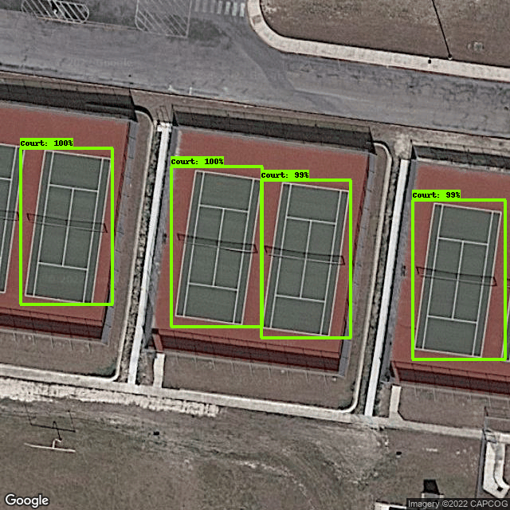

# Tennis Court Locator
## Purpose:
I started this project to help identify local tennis courts in my area. Many of the known courts are private, or require some sort of membership or pay-to-play in order to gain access to the court. Every once in a while, I'll discover a tennis court I didn't know existed and they are often open to the public. These courts don't normally come up in a search engine query. 

With this project, I will be able to identify all local tennis courts without the added effort of scrolling through aerial satellite images or driving around in my car.

## Model Methods:
### The dataset:
The process of identifying tennis courts will require a bit of machine learning with object detection. 
To my knowledge, a dataset that includes aerial images of tennis courts does not exist, therefore, I will have to create my own.
I've identified two sources that may help with creating a dataset:
1. [Approximately 30,000 tennis court locations throughout the US](https://data.world/mglobel/tennis-courts)
2. [Tennis court locations throughout the Washington, DC area](https://data.world/codefordc/tennis-court-sites)

With the location data, I utilized the [Google Maps static imageAPI](https://developers.google.com/maps/documentation/maps-static?csw=1) to obtain uniform PNG files of each location.

For each API call, I set the `size` parameter as `640x640` and the map `type` as `satellite`.
In order to provide variation in scale, I adjust the `zoom` level anywhere from `15` to `20`.

Once each file is saved to the image folder, I had to manually annotate each image with a bounding box.
The tool I chose to annotate each image with was [MakeSense.AI](https://www.makesense.ai/). 
The annotated images were exported in a .zip package containing files in the VOC XML format.

### Training the model:
For training my model, I wanted to use the [Tensorflow’s object detection API](https://github.com/tensorflow/models/tree/master/research/object_detection). It comes pre-packaged with a lot of helpful utility functions that simplify the development process.

In order to use TensorFlow on my system (macOS), I had to install `Miniforge` to create a separate environment and then follow the [TensorFlow Installation Guide](https://developer.apple.com/metal/tensorflow-plugin/) for getting setup.

I created the environment with:
~~~
    conda create --name tf python=3.9
~~~

Then I can activate and deactivate the environnement with:
~~~
    conda deactivate
    conda activate tf
~~~

This all worked beautifully, however, the `Object Detection API` still does not appear to have support for `Apple Silicon` machines. Which I learned after a number of attempts to install the package.

Instead, I used [Google Colab](https://colab.research.google.com/notebooks/intro.ipynb) to host the API for training and Google Drive for storage. `Google Colab` sessions expire after 12 hours, so google drive works as temporary storage while training.

In order to utilize `Tensorflow’s object detection API`, I had to convert my annotated images into `TFRecord format`.

I generated a tf record from my XML format annotations with Tensor Flow's Object Detection [conversion script](https://github.com/tensorflow/models/blob/master/research/object_detection/g3doc/using_your_own_dataset.md).

I had to create a label map file, `labelmap.pbtxt`, to define the classes that are going to be used. 
I only used one class, so this was a pretty simple file:
~~~
    item {
        name: "Court"
        id: 1
    }
~~~
The tensorflow models repository provides a number of pre-trained models from the [COCO 2017 dataset](https://cocodataset.org/#home). These pre-trained models can be useful for initializing novel datasets such as mine. 

I downloaded the `SSD MobileNet V2 FPNLite 640x640` model since it appears to have a decent balance of speed, `39 ms` and accuracy, `28.2 COCO mAP` with image inputs of 640x640.

I utilized the pipeline.config file from the pre-trained model and modified a few inputs:
- I input paths to my model checkpoints and label map
- I set the number of classes to 1 since I only have one class
- I used a batch size of 21 initially, however, this used too much memory for google colab, so I reduced the size to 7. Since I trained with 147 samples, 7 is a moderate propagation size that suits the system memory and is also divisible by 147
- The number of steps I chose was 200,000 
- I swapped the `fine_tune_checkpoint_type:` to `detection` to restore all weights from the checkpoint

### Testing the model
Overall, I think the model identifies courts pretty well. The test images were a decent mix of high quality photos with well defined court lines as well as poor quality photos and/or poorly defined court lines.

The model did really well at identifying courts with clearly defined court lines:

However, if the court was in bad shape or the quality of the image prevented the model from seeing the court lines, then the model could not identify the court within a 60% threshold:

## Exporting the model
For this project, I wanted to use [TensorFlow.js](https://www.tensorflow.org/js) so that I could use my trained model directly in the browser.

To use `TensorFlow.js`, I first had to convert my saved model to Tensorflow.js layers format. To do this, I had to utilize the [TensorFlow.js converter](https://github.com/tensorflow/tfjs/tree/master/tfjs-converter).

I tried to do this on my local machine, but there doesn't appear to be support for `Apple M1 chips`, so this was completed in `Google colab`.

## Mapping service
The main mapping component library I used was [Leaflet](https://leafletjs.com/index.html). The library is open-source and comes with tons of interactive features and useful plugins. 

The map tile imagery service I used came from the [ArcGIS World Imagery map server](http://leaflet-extras.github.io/leaflet-providers/preview/#filter=Esri).

## Running the model
In order to load the model, I had to refer back to the model type.
When I initially trained and exported the python model, the input format was tf_saved_model.
When I converted the model for tensorflow.js with the conversion wizard, an output flag was not provided. However, [this tensorflow guide](https://github.com/tensorflow/tfjs/blob/master/tfjs-converter/README.md) states that `Unless stated otherwise, we can infer the value of --output_format from the value of --input_format. So the --output_format flag can be omitted in most cases.`Based on the table in the guide, the infered output format is in the TensorFlow.js `graph model format`. So I had to use [`tf.loadGraphModel()`](https://js.tensorflow.org/api/latest/#loadGraphModel) to load the model.

When running the model against the `asyncExecute` method, the 8 output tensors are partially labeled. 3 tensors are given an arbitrary name. This appears to be an issue that occurred during the model conversion process. After reviewing this [tfjs issue](https://github.com/tensorflow/tfjs/issues/3942), I mapped my missing tensors with the identified tensors in [this](https://github.com/tensorflow/tfjs/issues/3942#issuecomment-728013232) answer. 

The `saved_model` output matched my `graph_model` output almost exactly. So I made the assumption that the missing Tensor labels are the following:

~~~
    Identity:0 => detection_anchor_indices
    Identity_2 => detection_classes
    Identity_4 => detection_scores
~~~

When I run the model in the browser, good results are heavily dependent on the size of the input image. 
The model returns the best results when the input image is less than or equal to `640 x 640`.
In addition, the map must be set to maximum or near maximum zoom for good results.
This significantly reduces the opportunity to discover tennis courts over a large area. 

To increase the performance of the model, I think additional training images are necessary.

## Improvements

### Re-train the model
I trained the model with 147 images.
I'll need to annotate more images (500 - 1000 at a minimum) to train the object detection model in the future.
In addition, i'll need more high quality images taken at higher elevations than the previous images.
There are memory and computation time constraints with `Google Colab`, so until the `TensorFlow Object Detection API` is made compatible with `Apple Silicon`, I will have to wait to train the model again. 

### Multiple image inputs
Another potential improvement could include capturing multiple images of the map and running an inference on each image.
This could satisfy the image sizing issue (less than or equal to `640 x 640`) and could scan a much larger area.
However, running multiple inferences could increase execution time. I could potentially run each inference in parallel if memory and cpu load doesn't present itself as issues.

### SAHI
Small object detection and inference on large images appear to be a common issue in computer vision. 
An interesting [article](https://blog.ml6.eu/how-to-detect-small-objects-in-very-large-images-70234bab0f98) details the concept of `Slicing-Aided Hyper Inference (SAHI)`. 

~~~
    SAHI’s sliced predictions break down the input image into slightly overlapping patches, performs prediction on each patch and finally merges the annotations for each patch to visualize them on the original image.
~~~

The [SAHI Github repo](https://github.com/obss/sahi) shows that the inference works on a handful of popular model formats. In order to use SAHI, I would need to retrain or convert (if possible) my model to a compatible format. However, I would not be able to run inference directly in the browser like `Tensorflow.js`.